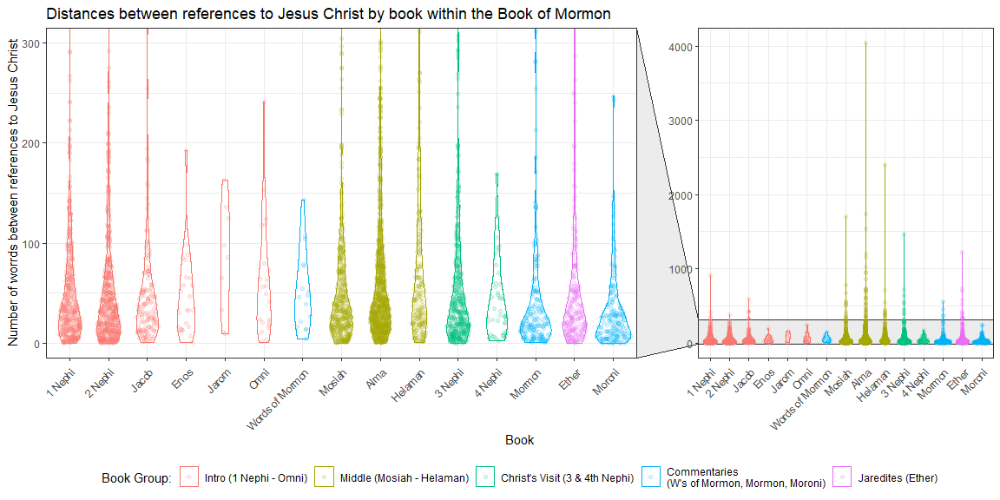

```r
# Use this R-Chunk to import all your datasets!
temp <- tempfile()
download.file("http://scriptures.nephi.org/downloads/lds-scriptures.csv.zip",temp)
scripture <- read.csv(unzip(temp))
unlink(temp)

Savior_names <- readRDS(url("https://byuistats.github.io/M335/data/BoM_SaviorNames.rds"))
```

## Background

Get the scripture and savior name data into R. This is the exact same same scripture and Savior name data as the previous week's case study.
Use the list of Savior names and the Book of Mormon text to find the distribution of words between references to the Savior for each book in the Book of Mormon.
Find each instance of a Savior name in the Book of Mormon.
Split on those instances and then count the number of words between each instance.
Use the purrr package to do this efficiently
Reuse your code from last week's case study as a starting point for this case study. Turn your prior code into a function that can be applied to each book in the Book of Mormon. Use map(), mutate(), and your custom function to accomplish this case study.
Create a plot that visualizes the distribution of words between references to the Savior for each book in the Book of Mormon. Ideally the plot should facilitate easy comparison between the distributions.

## Data Wrangling


```r
# functions
#bookkey1 <- "1 Nephi"
build_table <- function(bookkey){
Filt <- filter(scripture, scripture$book_title == bookkey ) %>% pull(scripture_text) %>% str_c(collapse = " ")
distances <- str_split(Filt, pattern = names)
dataFrame <- as.data.frame(distances,
                           col.names = c("words"))
dataFrame$wordCount <- stri_count_words(dataFrame$words)
#dataFrame$book <- bookkey
dataFrame <- dataFrame[,2]
}

splitlist <- function(x){
x <- str_replace_all(x, ",", ":")
x <- str_replace_all(x, "\\{", "-")
x <- str_remove_all(x, "-")
x <- strsplit(x, ":", fixed = T)
}
```


```r
# Use this R-Chunk to clean & wrangle your data!
scripture <- filter(scripture, scripture$volume_title == "Book of Mormon")

names <- Savior_names %>%
  pull(name) %>% 
  str_c(collapse = "|")

#get list of all placekeys
book_key_list <- unique(select(scripture, book_title))
#book_key_list <- slice_head(book_key_list, n=5)
book_key_list_l <- splitlist(book_key_list[,1])

#map function for mostPop days
book_key_list$result <- map(book_key_list[,1], build_table)
book_key_list <- unnest(book_key_list, result)


#`%!in%` <- Negate(`%in%`) - Not in operator

book_key_list$book_title <- fct_inorder(book_key_list$book_title)
book_key_list$book_group <- case_when(book_key_list$book_title %in% c("1 Nephi", "2 Nephi", "Jacob", "Enos", "Jarom", "Omni" ) ~ "Intro (1 Nephi - Omni)", book_key_list$book_title %in% c("Mosiah", "Alma", "Helaman") ~ "Middle (Mosiah - Helaman)", book_key_list$book_title %in% c("3 Nephi", "4 Nephi") ~ "Christ's Visit (3 & 4th Nephi)", book_key_list$book_title %in% c("Words of Mormon", "Mormon", "Moroni") ~ "Commentaries \n(W's of Mormon, Mormon, Moroni)", book_key_list$book_title %in% c("Ether") ~ "Jaredites (Ether)")
book_key_list$book_group <- factor(book_key_list$book_group, levels= c("Intro (1 Nephi - Omni)", "Middle (Mosiah - Helaman)", "Christ's Visit (3 & 4th Nephi)","Commentaries \n(W's of Mormon, Mormon, Moroni)", "Jaredites (Ether)")) 
```

## Data Visualization


```r
# Use this R-Chunk to plot & visualize your data!
ggplot(data=book_key_list, )+
  geom_violin(aes(x=book_title, y=result, color=book_group))+
  facet_zoom(ylim = c(0, 300), zoom.data=zoom)+
  #facet_grid(~book_group)
  geom_sina(aes(x=book_title, y=result, color=book_group),alpha=0.15)+
  theme_bw()+
  theme(axis.text.x = element_text(angle = 45, vjust = 0.95, hjust=1))+
  theme(legend.position="bottom")+
  labs(title="Distances between references to Jesus Christ by book within the Book of Mormon", color= "Book Group:")+
  xlab("Book")+ylab("Number of worrds between references to Jesus Christ")
```

<!-- -->

## Conclusions
