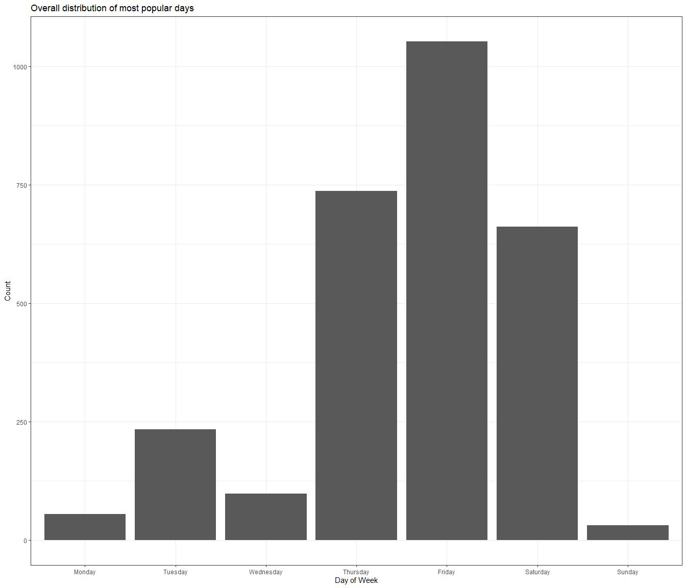
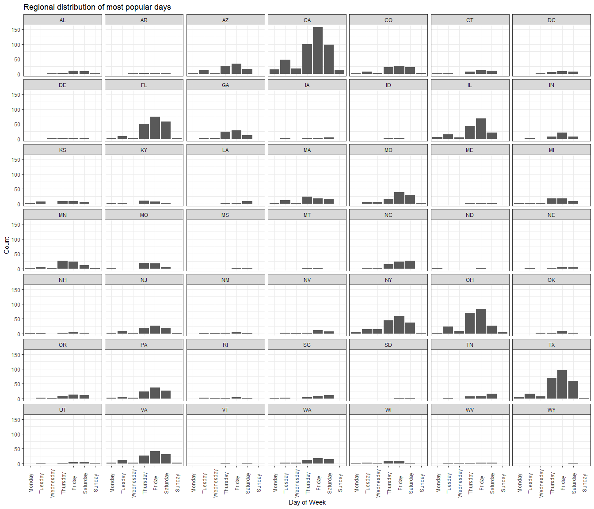
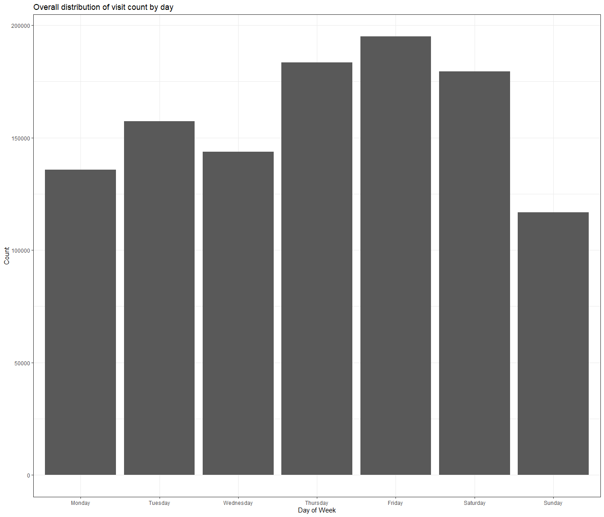
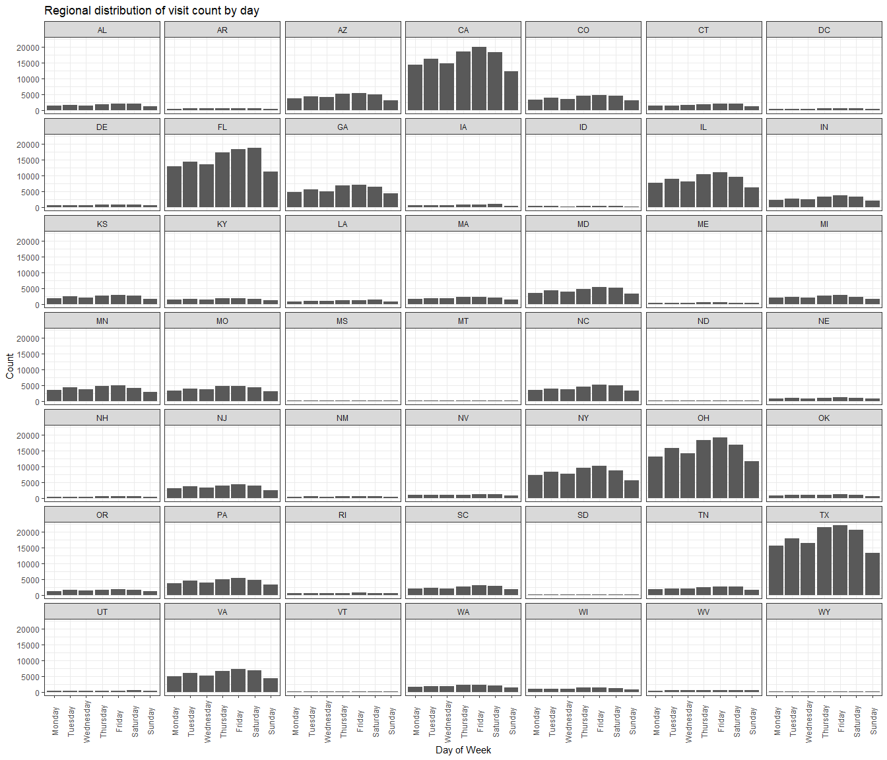

```r
# Use this R-Chunk to import all your datasets!
temp <- tempfile()
download.file("https://byuistats.github.io/M335/data/chipotle_reduced.csv",temp)
restDat <- read.csv(temp)
unlink(temp)
```

## Background

Read in the restaurant level data: https://byuistats.github.io/M335/data/chipotle_reduced.csv (Links to an external site.)
Here is a data dictionary: https://docs.safegraph.com/docs/monthly-patterns (Links to an external site.)
Use the functions you created in the previous task to:
Obtain the frequency (or proportion) that each day of the week is selected as the most popular day for a restaurant (Function 1). Then visualize the results overall and another chart that facets by region.
Combine the popularity_by_day data across all restaurants. Then visualize the frequency (or proportion) distribution of visits by day of the week regardless of restaurant (Function 2). This visualization should be done overall and another chart that facets by region.
Ensure that each of the 4 visualizations above are presentation worthy.
Based on your above visualizations, make a recommendation regarding which day(s) of the week Chipotle’s big promotion should run and mention any other worthy insights.

## Data Wrangling


```r
#Functions

splitlist <- function(x){
x <- str_replace_all(x, ",", ":")
x <- str_replace_all(x, "\\{", "-")
x <- str_remove_all(x, "-")
x <- strsplit(x, ":", fixed = T)
}

build_table <- function(placekey1){
Filt <- select(filter(restDat, restDat$placekey == placekey1 ), `popularity_by_day`)
x <- splitlist(Filt)

result <- cbind(Filt[rep(1:nrow(Filt), lengths(x)), 1], content = unlist(x))

results <- data.frame(
  "day" = result[seq(1,length(result[,1]),2), "content"], 
  "Num_visitors" = result[seq(2,length(result[,1]),2), "content"])
results$day <- str_remove_all(results$day, "\"")
results$day <- str_replace_all(results$day, "[^[:alnum:]]", "") 
results$Num_visitors <- str_replace_all(results$Num_visitors, "[^[:alnum:]]", "") 
results
}


MostPop <- function(placekey1){
Filt <- select(filter(restDat, restDat$placekey == placekey1 ), `popularity_by_day`)
x <- splitlist(Filt)

result <- cbind(Filt[rep(1:nrow(Filt), lengths(x)), 1], content = unlist(x))

results <- data.frame(
  "day" = result[seq(1,length(result[,1]),2), "content"], 
  "Num_visitors" = result[seq(2,length(result[,1]),2), "content"])
results$day <- str_remove_all(results$day, "\"")
results$day <- str_replace_all(results$day, "[^[:alnum:]]", "")
results$Num_visitors <-str_replace_all(results$Num_visitors, "[^[:alnum:]]", "") 
M <- max(as.numeric(results$Num_visitors), data=results)
results <- select(filter(results, results$Num_visitors == M ), `day`)
results
}
```


```r
#remove na's
restDat$popularity_by_day_X <- case_when(restDat$popularity_by_day == "" ~ 0, restDat$popularity_by_day != "" ~1)
restDat <- filter(restDat, restDat$popularity_by_day_X == 1)

#get list of all placekeys
placekey_list <- select(restDat, placekey)
#placekey_list <- slice_head(placekey_list, n=5)
placekey_list_l <- splitlist(placekey_list[,1])

#map function for mostPop days
placekey_list$result <- map(placekey_list[,1], MostPop)
placekey_list <- unnest(placekey_list, result)

#build region list for dictionary
region_list <- restDat$region
names(region_list) <- restDat$placekey
#run dict on results from above to return matching regions
placekey_list$region <- region_list[placekey_list$placekey]


placekey_list$day <- factor(placekey_list$day, levels = c("Monday", "Tuesday", "Wednesday", "Thursday", "Friday", "Saturday", "Sunday"))


#get list of all placekeys
placekey_list_visit <- select(restDat, placekey)
#placekey_list <- slice_head(placekey_list, n=5)
placekey_list_l_visit <- splitlist(placekey_list[,1])

#map function for mostPop days
placekey_list_visit$result <- map(placekey_list_visit[,1], build_table)
placekey_list_visit <- unnest(placekey_list_visit, result)

#run dict on results from above to return matching regions
placekey_list_visit$region <- region_list[placekey_list_visit$placekey]


placekey_list_visit$day <- factor(placekey_list_visit$day, levels = c("Monday", "Tuesday", "Wednesday", "Thursday", "Friday", "Saturday", "Sunday"))
```


## Data Visualization


```r
# Use this R-Chunk to plot & visualize your data!
ggplot(data= placekey_list)+
  geom_bar(aes(x=day))+
  labs(title="Overall distribution of most popular days")+
  xlab("Day of Week")+ylab("Count")+
  theme_bw()
```

<!-- -->

```r
ggplot(data= placekey_list)+
  geom_bar(aes(x=day))+
    labs(title="Regional distribution of most popular days")+
  xlab("Day of Week")+ylab("Count")+
  facet_wrap(~region)+
  theme_bw()+
  theme(axis.text.x = element_text(angle = 90, vjust = 0.5))
```

<!-- -->

```r
ggplot(data= placekey_list_visit)+
  geom_bar(stat= "identity", aes(x=day, y= as.numeric(Num_visitors)))+
  labs(title="Overall distribution of visit count by day")+
  xlab("Day of Week")+ylab("Count")+
  theme_bw()
```

<!-- -->

```r
ggplot(data= placekey_list_visit)+
  geom_bar(stat="identity", aes(x=day, y=as.numeric(Num_visitors)))+
    labs(title="Regional distribution of visit count by day")+
  xlab("Day of Week")+ylab("Count")+
  facet_wrap(~region)+
  theme_bw()+
  theme(axis.text.x = element_text(angle = 90, vjust = 0.5))
```

<!-- -->

## Conclusions
