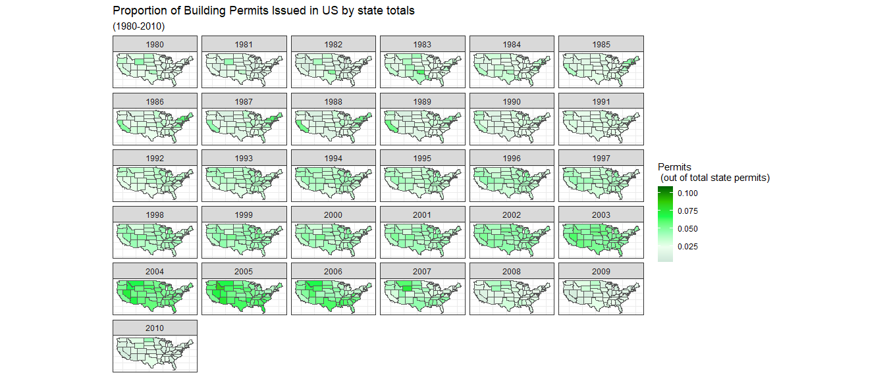
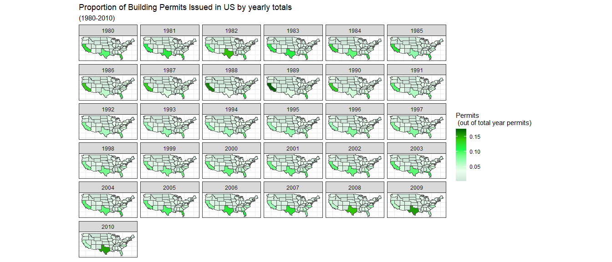
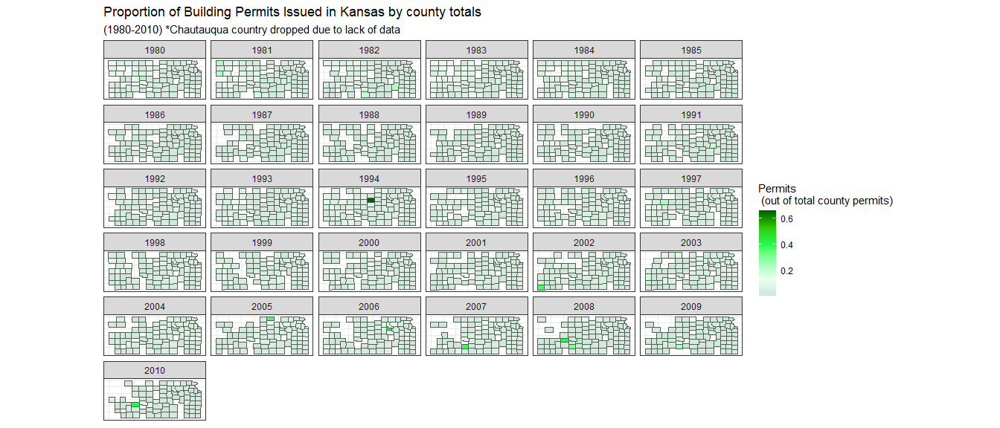
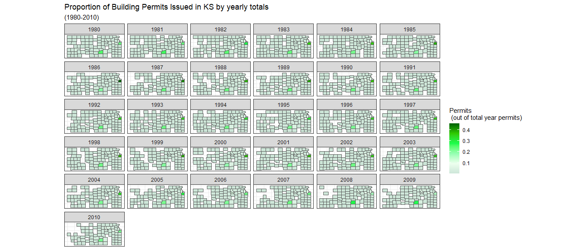

```r
# Use this R-Chunk to import all your datasets!
#devtools::install_github("hathawayj/buildings")
permits<- buildings::permits
states <- USAboundaries::us_states()
counties <-  USAboundaries::us_counties()

`%!in%` <- Negate(`%in%`)
```

## Background

_Place Task Background Here_

## Data Wrangling


```r
# Use this R-Chunk to clean & wrangle your data!

SF_permits <- permits %>% 
  filter(variable == "Single Family") %>% 
  group_by(StateAbbr, state, year) %>% 
  summarise(permit_sum = sum(value))

SF_permits_T <- permits %>% 
  filter(variable == "Single Family") %>% 
  group_by(StateAbbr, state) %>% 
  summarise(permit_sum = sum(value))

SF_permits_YT <- permits %>% 
  filter(variable == "Single Family") %>% 
  group_by(year) %>% 
  summarise(permit_sum = sum(value))

#build region list for dictionary
sum_list <- SF_permits_T$permit_sum
names(sum_list) <- SF_permits_T$StateAbbr
  
  #run dict on results from above to return matching regions
SF_permits$state_sum <- sum_list[SF_permits$StateAbbr]
  
#build region list for dictionary
sum_list1 <- SF_permits_YT$permit_sum
names(sum_list1) <- SF_permits_YT$year

  #run dict on results from above to return matching regions
SF_permits$year_sum <- sum_list1[as.factor(SF_permits$year)]


SF_permits$permit_prop <- SF_permits$permit_sum / SF_permits$state_sum


SF_permits$year_prop <- SF_permits$permit_sum / SF_permits$year_sum

states <- states %>% 
  select(state_abbr, geometry)
colnames(states) <- c("StateAbbr", "geometry")


geo_permits <- SF_permits %>% 
  inner_join(states, by = c("StateAbbr")) %>%
  filter(StateAbbr %!in% c("AK","HI"))


KS_permits <- permits %>% 
  filter(variable == "Single Family", StateAbbr == "KS" & county != 19) %>% 
  group_by(StateAbbr, state, county, year) %>% 
  summarise(permit_sum = sum(value))

KS_permits_T <- KS_permits %>% 
  group_by(county) %>% 
  summarise(permit_sum = sum(permit_sum))

KS_permits_YT <- KS_permits %>% 
  group_by(year) %>% 
  summarise(permit_sum = sum(permit_sum))

#build region list for dictionary
sum_list_KS <- KS_permits_T$permit_sum
names(sum_list_KS) <- KS_permits_T$county
  
  #run dict on results from above to return matching regions
KS_permits$county_sum <- sum_list_KS[as.factor(KS_permits$county)]
  
#build region list for dictionary
sum_list1_KS <- KS_permits_YT$permit_sum
names(sum_list1_KS) <- KS_permits_YT$year

  #run dict on results from above to return matching regions
KS_permits$year_sum <- sum_list1_KS[as.factor(KS_permits$year)]

KS_permits$permit_prop <- KS_permits$permit_sum / KS_permits$county_sum


KS_permits$year_prop <- KS_permits$permit_sum / KS_permits$year_sum

KS_counties <- counties %>% select(state_abbr, countyfp,geometry) %>% filter(state_abbr == "KS" )

KS_counties$county <- as.numeric(KS_counties$countyfp)

geo_KS <- KS_permits %>% 
  inner_join(KS_counties, by = c("county"))

geo_KS$is_crash <- case.names(geo_KS$year %in% c(2007,2008))
geo_permits$is_crash <- case.names(geo_permits$year %in% c(2007,2008))
```

## Data Visualization


```r
# Use this R-Chunk to plot & visualize your data!

color_list <- c("#cde6d8", "#ecffee","#94ffb1","#1afd4d", "#30cb00", "#006203")


ggplot(data = geo_permits) +
  geom_sf(mapping = aes(fill = permit_prop,
                        geometry = geometry)) +
  scale_fill_gradientn(colors = color_list) +
  theme_bw() +
  facet_wrap(vars(year), ncol = 6) +
  theme(
    axis.ticks = element_blank(),
    axis.text = element_blank()
  ) +
  labs(
    title = "Proportion of Building Permits Issued in US by state totals",
    subtitle = "(1980-2010)",
    fill = "Permits \n (out of total state permits)"
  )
```

<!-- -->

```r
ggplot(data = geo_permits) +
  geom_sf(mapping = aes(fill = year_prop,
                        geometry = geometry)) +
  scale_fill_gradientn(colors = color_list) +
  theme_bw() +
  facet_wrap(vars(year), ncol = 6) +
  theme(
    axis.ticks = element_blank(),
    axis.text = element_blank()
  ) +
  labs(
    title = "Proportion of Building Permits Issued in US by yearly totals",
    subtitle = "(1980-2010)",
    fill = "Permits \n (out of total year permits)"
  )
```

<!-- -->

```r
  #theme(strip.background = element_rect(fill=c("firebrick", "lightblue")))


ggplot(data = geo_KS)  +
  geom_sf(mapping = aes(fill = permit_prop,
                        geometry = geometry)) +
  scale_fill_gradientn(colors = color_list) +
  theme_bw() +
  facet_wrap(vars(year), ncol = 6) +
  theme(
    axis.ticks = element_blank(),
    axis.text = element_blank()
  ) +
  labs(
    title = "Proportion of Building Permits Issued in Kansas by county totals",
    subtitle = "(1980-2010) *Chautauqua country dropped due to lack of data",
    fill = "Permits \n (out of total county permits)"
  )
```

<!-- -->

```r
ggplot(data = geo_KS  ) +
  geom_sf(mapping = aes(fill = year_prop,
                        geometry = geometry)) +
  scale_fill_gradientn(colors = color_list) +
  theme_bw() +
  facet_wrap(vars(year), ncol = 6) +
  theme(
    axis.ticks = element_blank(),
    axis.text = element_blank()
  ) +
  labs(
    title = "Proportion of Building Permits Issued in KS by yearly totals",
    subtitle = "(1980-2010) ",
    fill = "Permits \n (out of total year permits)"
  )
```

<!-- -->

## Conclusions

The first two plot show the US as a whole, the second two plots focus on Kansas. Each pair is follows a pattern with the first plot servering the purpose of visualizing growth within each state/county over time relative to that state/county. In contrast the second serves to show growth within a state/county relative to the state/counties total # of permits over the 31 year timespan.

In other words, the first plot in each pair explains when a particular state/county was growing the most relative to that states/counties total growth. The second shows which states/counties grew the most during a given year.
