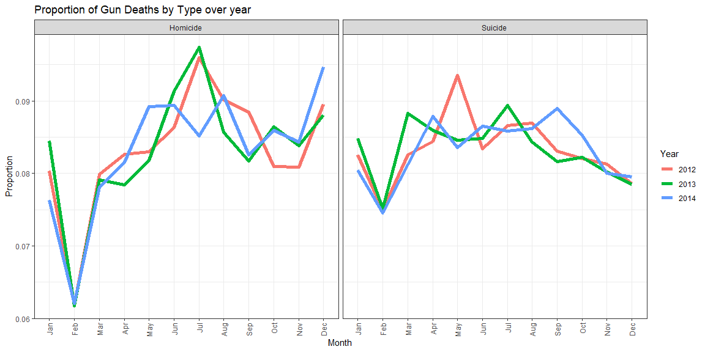
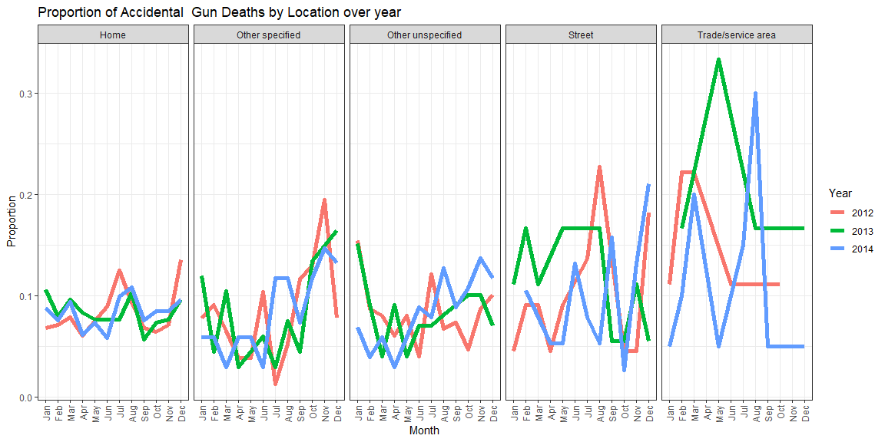

```r
# Use this R-Chunk to import all your datasets!
#https://github.com/fivethirtyeight/guns-data
gundata <- read_csv(url("https://github.com/fivethirtyeight/guns-data/raw/master/full_data.csv"))
```

## Background

In one or two sentences, state in your own words the thesis of this video, The state of gun violence in the US, explained in 18 charts. (Links to an external site.)
Consider the video's insights. Create one plot that adds or retells (at least partially) that story.

Write a short paragraph explaining your plot and how it fits into the video's bigger narrative.

Address the client’s need for emphasis areas of their commercials for different seasons of the year.

Provide plots that help them know the different potential groups (variables) they could address in different seasons (two to four visualizations seem necessary).
Write a short paragraph describing each image.

Compile your .rmd, .md and .html file into your git repository.

## Data Wrangling


```r
# Use this R-Chunk to clean & wrangle your data!
gundata$monthName <- month.abb[as.numeric(gundata$month)]
gundataHnS <- filter(gundata, intent == "Suicide" | intent == "Homicide")
gundataOther <- filter(gundata, intent != "Suicide" & intent != "Homicide")


gundataHnS$count <- 1
gundataHnS_M <-gundataHnS %>%
  group_by(month, year, intent) %>%
  summarise_at(vars(count), list(intent_sum = sum, percent = mean))

gundataHnS_S<-gundataHnS %>%
  group_by(year, intent) %>%
  summarise_at(vars(count), list(intent_sum = sum))


gundataHnS_M$percent <- case_when(gundataHnS_M$year == 2012 & gundataHnS_M$intent== "Homicide" ~12093,
gundataHnS_M$year == 2012 & gundataHnS_M$intent=="Suicide" ~20666,
gundataHnS_M$year == 2013 & gundataHnS_M$intent== "Homicide" ~11674,
gundataHnS_M$year == 2013 & gundataHnS_M$intent=="Suicide" ~21175,
gundataHnS_M$year == 2014 & gundataHnS_M$intent== "Homicide" ~11409,
gundataHnS_M$year == 2014 & gundataHnS_M$intent=="Suicide" ~21334)

gundataHnS_M$Prop <- gundataHnS_M$intent_sum / gundataHnS_M$percent
gundataHnS_M$monthName <- month.abb[as.numeric(gundataHnS_M$month)]


gundataAcc <- filter(gundata, intent == "Accidental" & place %in% c("Home", "Other specified", "Other unspecified", "Street", "Trade/service area"))
gundataAcc$count <- 1
gundataAcc_M <-gundataAcc %>%
  group_by(month, year, place) %>%
  summarise_at(vars(count), list(intent_sum = sum, percent = mean))
gundataAcc_M$yearplace <-  paste(gundataAcc_M$year, gundataAcc_M$place)


gundataAcc_S<-gundataAcc %>%
  group_by(year, place) %>%
  summarise_at(vars(count), list(intent_sum = sum))
gundataAcc_S$yearplace <- paste(gundataAcc_S$year, gundataAcc_S$place)


gundatAcc_M <- merge(gundataAcc_M,gundataAcc_S,by="yearplace")
gundatAcc_M$Prop <- gundatAcc_M$intent_sum.x / gundatAcc_M$intent_sum.y
```

## Data Visualization


```r
# Use this R-Chunk to plot & visualize your data!
p1 <-ggplot(gundataHnS_M, aes(x =as.numeric(month), y= Prop, color=factor(year))
)+ 
   geom_line(size=2)+ 
   labs(x="Month")+
  facet_grid(rows=~intent)+
  theme_bw()+ scale_x_discrete(limits = month.abb)+
  labs(color= "Year", title= "Proportion of Gun Deaths by Type over year")+ 
  ylab("Proportion")+
  xlab("Month")
  
p1 +  theme(axis.text.x = element_text(angle = 90, vjust = 0.5, hjust=1))
```

<!-- -->

```r
p2 <-ggplot(gundatAcc_M, aes(x =as.numeric(month), y= Prop, color=factor(year.x))
)+ 
   geom_line(size=2)+ 
   labs(x="Month")+
  facet_grid(rows=~place.x)+
  theme_bw()+ scale_x_discrete(limits = month.abb)+
  labs(color= "Year", title= "Proportion of Accidental  Gun Deaths by Location over year")+ 
  ylab("Proportion")+
  xlab("Month")
  
p2 +  theme(axis.text.x = element_text(angle = 90, vjust = 0.5, hjust=1))
```

<!-- -->

## Conclusions
1.
The video seemed centered around the idea that there is alot more going on with gun deaths than we often seem to hear about. Specifically within the US, even with many other variables accounted for we have a disproportionate number of gun deaths relative to other developed countries.
2. My first plot is meant to help highlight the seasonal trends in Homicde vs. Suicide gun deaths throughout the year, showing when the largest proportion of each occurs on average. This plot is also meant to be used for question three, showing the need to focus on Homicide based deaths in summer and December but shift to suicide based deaths in the spring and fall.
3. Additionally the second chart is meant to highlight by location and monthwhere accidental gun deaths seem to occur most frequently, this could be used to help understand more deeply the source of these accidents and provide the needed warning to attempt to prevent such accidents.
