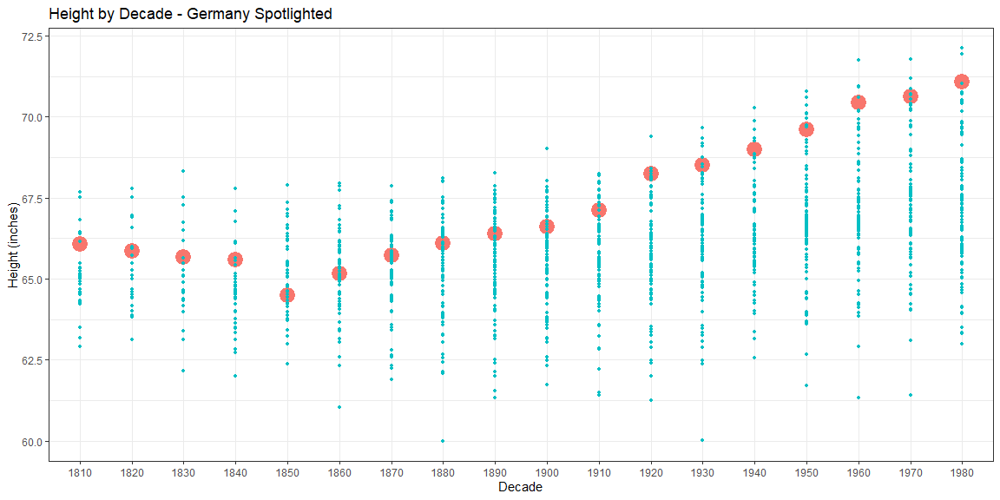
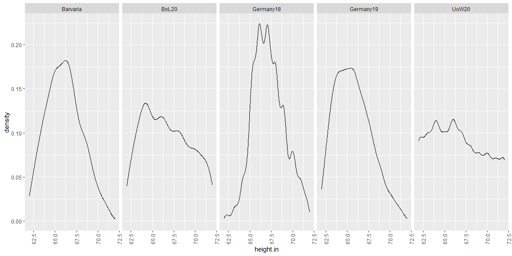
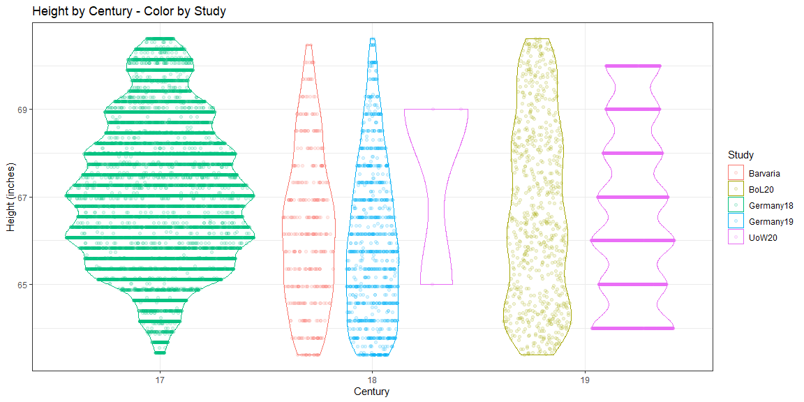

```r
# Use this R-Chunk to import all your datasets!
download("https://byuistats.github.io/M335/data/heights/Height.xlsx", dest="myxl.xlsx", mode="wb")
myxl <- tempfile(fileext = ".xlsx")
WorldWide <- read_xlsx("myxl.xlsx")


g19 <- read_stata(url("https://byuistats.github.io/M335/data/heights/germanconscr.dta"))
b19 <- read_stata(url("https://byuistats.github.io/M335/data/heights/germanprison.dta"))


temp <- tempfile()
download.file("https://byuistats.github.io/M335/data/heights/Heights_south-east.zip",temp)
g18 <- read.dbf(unzip(temp))
unlink(temp)

us20 <- read.csv(url("https://raw.githubusercontent.com/hadley/r4ds/main/data/heights.csv"))

w20 <- read_sav(url("http://www.ssc.wisc.edu/nsfh/wave3/NSFH3%20Apr%202005%20release/main05022005.sav"))
```

## Background

### Part 1: Heights by nation

Read in and tidy the Worldwide estimates .xlsx file (Links to an external site.)
Make sure the file is in long format with year as a column. See Example of the Tidy Excel File after formatting (Links to an external site.).
Use the separate() and mutate() functions to create a decade column.
Make a plot with decade on the x-axis and and all the countries heights in inches on the y-axis; with the points from Germany highlighted based on the data from the .xlsx file.

### Part 2: Heights of individuals from different centuries

Now work with datasets where each row represents an individual. Import these five datasets into R and combine them into one tidy dataset.
German male conscripts in Bavaria, 19th century: Stata format (Links to an external site.).
Heights of bavarian male conscripts, 19th century: Stata format (Links to an external site.).
Heights of south-east and south-west german soldiers born in the 18th century: DBF format (Links to an external site.).
This file is zipped. After downloading it with  download(), trying using  unzip()  and  read.dbf() to load the data into R.
Can you tell which column is the birth year? HINT: Google translate may be helpful.
Bureau of Labor Statistics Height Data: csv format (Links to an external site.)
Note: There is no birth year, so just assume mid-20th century and use 1950 as birth year
University of Wisconsin National Survey Data: SPSS (.sav) format (Links to an external site.)
You'll want to look here to understand this dataset and know which columns to use: National Survey Codebook (Links to an external site.)
After your wrangling, each dataset should only contain the following columns: 
select(birth_year, height.in, height.cm, study)
Use the following code to combine your five individual dataset into one dataset:
alld <- bind_rows(b19, g18, g19, us20, w20)
Make a small-multiples plot of the five studies containing individual heights to examine the question of height distribution across centuries.

### Part 3: Putting it all together

Save the two tidy datasets from Part 1 and Part 2 above to your project as r datasets.
Create an .Rmd file with one to two paragraphs summarizing your graphics and how those graphics answer the driving question.
Push your saved datasets, .Rmd, .md, and .html to your GitHub repository.

## Data Wrangling


```r
# Use this R-Chunk to clean & wrangle your data!
colnames(WorldWide) <- c(WorldWide[2,])
WorldWide <- WorldWide[-c(1,2), ]

LongWW <- WorldWide %>%
  pivot_longer(c(3:203), names_to = "year_decade", values_to = "Height.cm")
LongWW <- LongWW %>%drop_na(Height.cm)

LongWW <- LongWW %>% 
  separate(year_decade, into = c("century", "year"), sep = 2,remove = FALSE)
LongWW <- LongWW %>% 
  separate(year, into = c("decade", "year"), sep = 1)
LongWW <-   LongWW %>% mutate(
         Height.in = Height.cm * 0.393701)

#Sort and Write to RDS
LongWW <- LongWW %>%
   arrange(year_decade)
write_rds(LongWW, "LongWW.rds")

LongWWPlot <-LongWW
LongWWPlot$isG <- case_when(LongWWPlot$`Continent, Region, Country` == "Germany" ~ "Germany", LongWWPlot$`Continent, Region, Country` != "Germany" ~ "Other")
LongWWPlot$isGS <- case_when(LongWWPlot$isG == "Germany" ~ 1.5, LongWWPlot$isG != "Germany" ~ 1)


b19 <- b19 %>% select(bdec, height)
names(b19) <- c('birth_year', 'height.cm')
b19$study <- "Barvaria"
b19$height.in <- b19$height.cm * 0.393701
b19 <- b19 %>% drop_na()

g19 <- g19 %>% select(bdec, height)
names(g19) <- c('birth_year', 'height.cm')
g19$study <- "Germany19"
g19$height.in <- g19$height.cm * 0.393701
g19 <- g19 %>% drop_na()


g18 <- g18 %>% select(GEBJ, CMETER)
names(g18) <- c('birth_year', 'height.cm')
g18$study <- "Germany18"
g18$height.in <- g18$height.cm * 0.393701
g18 <- g18 %>% drop_na()

w20 <- w20 %>% select(DOBY, RT216I, RT216F)
names(w20) <- c('birth_year', 'height.in', 'height.F' )
w20$study <- "UoW20"
w20$height.in <-  (w20$height.F * 12) + w20$height.in
w20$height.cm <- w20$height.in / 0.393701
w20 <- w20 %>% drop_na()
w20$birth_year <- as.numeric(w20$birth_year) +1900
w20 <- w20 %>% select(birth_year, height.in, height.cm, study)

us20 <- us20 %>% select(age, height)
names(us20) <- c('birth_year', 'height.in')
us20$study <- "BoL20"
us20$height.cm <- us20$height.in / 0.393701
us20 <- us20 %>% drop_na()
us20$birth_year <- 1950
us20 <- us20 %>% select(birth_year, height.in, height.cm, study)

#Combine and Write to RDS
alld <- bind_rows(b19, g18, g19, us20, w20)
write_rds(alld, "alld.rds")


alld$birth_cen <- floor(as.numeric(alld$birth_year/100))
alld$birth_dec <- ((alld$birth_year / alld$birth_cen)-100) *alld$birth_cen
```

## Data Visualization


```r
# Use this R-Chunk to plot & visualize your data!
ggplot(data=LongWWPlot, ) +
    geom_point(aes(x=year_decade, y=Height.in, color= isG, size=isGS))+
  labs(color= "Is Germany", size= "Is Germany", title= "Height by Decade - Germany Spotlighted")+ 
  ylab("Height (inches)")+
  xlab("Decade")+
  theme_bw()+
  theme(legend.position="none")
```

<!-- -->

```r
ggplot(data=alld, ) +
  geom_density(aes(x=height.in) )+
  facet_grid(rows =  ~study)+
  scale_x_continuous(limits = quantile(alld$height.in, c(0.05, 0.95)))+
  theme(axis.text.x = element_text(angle = 90, vjust = 0.5, hjust=1))
```

<!-- -->

```r
ggplot(data=alld, )+
  geom_violin(aes(x=as.factor(birth_cen), y=height.in, color=study))+
  geom_sina(aes(x=as.factor(birth_cen), y=height.in, color=study),alpha=0.15)+
  #facet_grid(rows =  ~study)+
  scale_y_continuous(limits = quantile(alld$height.in, c(0.1, 0.9)))+
  labs(color= "Study", title= "Height by Century - Color by Study")+ 
  ylab("Height (inches)")+
  xlab("Century")+
  theme_bw()
```

<!-- -->

## Conclusions

The First plot shown depicts the decade (1-9) and highlights germany's high values by increasing size and changing color. There are multiple dots along some X values because this dataset spans multiple centuries.

The third and second plots provide a side by side view of the distributions of each study over centuries to allow for height comparison by century.
