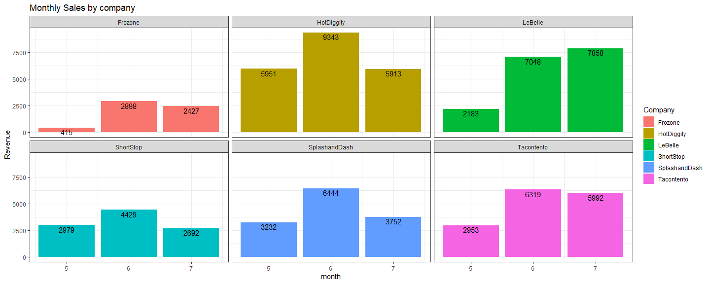
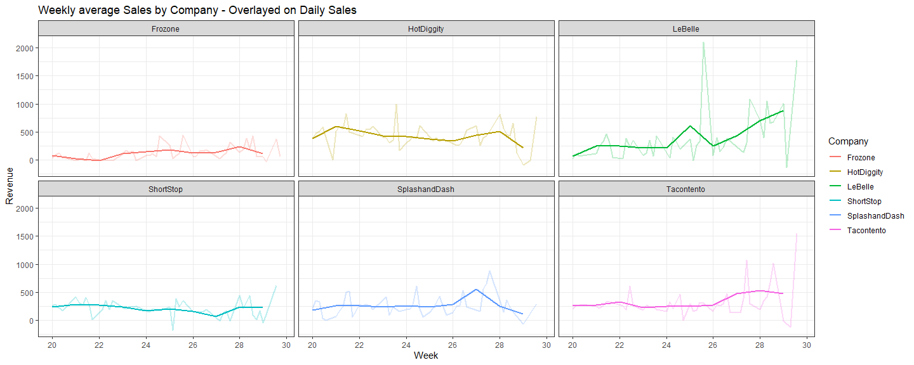
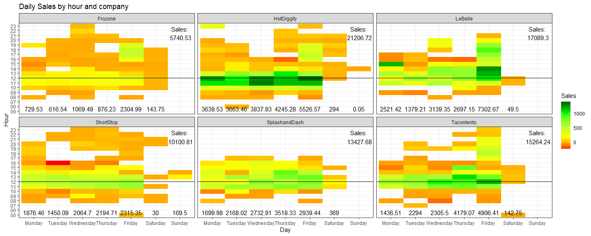
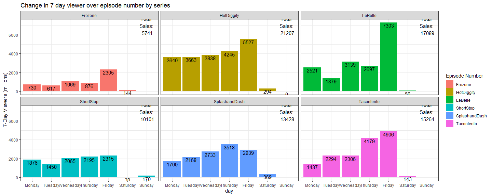

```r
# Use this R-Chunk to import all your datasets!
sales_dat <- read.csv("https://byuistats.github.io/M335/data/sales.csv")
```

## Background

Read in the data from https://byuistats.github.io/M335/data/sales.csv and format it for visualization and analysis.

The data are for businesses in the mountain time zone make sure you read in times correctly.

This is point of sale (pos) data, so you will need to use library(lubridate) to create the correct time aggregations.

Check the data for any inaccuracies.

Help your boss understand which business is the best investment through visualizations.
Provide an understanding and recommendation for hours of operation.
We don’t have employee numbers, but sales traffic can help. Provide some visualizations on customer traffic.
Provide a final comparison of the six companies and a final recommendation.

#### Pander doesn't display properly in the .md. use the html for best viewing

## Data Wrangling


```r
# Use this R-Chunk to clean & wrangle your data!
sales_dat$Time <- ymd_hms(sales_dat$Time, tz = "MST")
sales_dat$Time <- ceiling_date(sales_dat$Time, "hour")
sales_dat$hour <- format(as.POSIXct(sales_dat$Time), format = "%H")
sales_dat$day <- weekdays(as.POSIXct(sales_dat$Time), abbreviate = F)
sales_dat$week <- week(as.POSIXct(sales_dat$Time))
sales_dat$month<- month(as.POSIXct(sales_dat$Time))

sales_dat$day <- fct_inorder(sales_dat$day)
sales_dat<-sales_dat %>% filter(Name != "Missing", month != 4)
```

## Data Visualization


### Monthly 


```r
# Use this R-Chunk to plot & visualize your data!
 
 

sales_sum_Week <- sales_dat %>% 
  group_by(Name, week, day) %>% 
  summarise(Rev = sum(Amount))
sales_sum_Week$day <- case_when(
  sales_sum_Week$day == "Monday" ~ 0,
  sales_sum_Week$day == "Tuesday" ~ 1,
  sales_sum_Week$day == "Wednesday" ~ 2,
  sales_sum_Week$day == "Thursday" ~ 3,
  sales_sum_Week$day == "Friday" ~ 4,
  sales_sum_Week$day == "Saturday" ~ 5,
  sales_sum_Week$day == "Sunday" ~ 6)
sales_sum_Week$week_d <- sales_sum_Week$week + sales_sum_Week$day/7

sales_sum_Week_avg <- sales_sum_Week %>% group_by(Name, week) %>% summarise(Rev_avg = mean(Rev))

sales_sum <- sales_dat %>% 
  group_by(Name, day, hour) %>% 
  summarise(Rev = sum(Amount))
sales_sum_D <- sales_dat %>% 
  group_by(Name, day) %>% 
  summarise(Rev_sum = sum(Amount))
sales_sum_W <- sales_dat %>% 
  group_by(Name) %>% 
  summarise(Rev_sum = sum(Amount))
sales_sum_W$day = "Sunday"


sales_sum_M <- sales_dat %>% 
  group_by(Name, month) %>% 
  summarise(Rev = sum(Amount))

#levels(sales_sum$day)

#labels_week <- c("Monday \n 4","Tuesday","Wednesday", "Thursday", "Friday", "Saturday", "Sunday")   


# Monthly:

ggplot() +
  geom_col(aes(x=month, y=Rev, fill=Name), position="dodge" ,  data=sales_sum_M)+
  #geom_hline(aes(yintercept = Mean7day), bake10M)+
  geom_text(
    aes(label = paste(round(Rev,0)), x= month ,y = round(Rev,0)),vjust=1.2,
    position = position_dodge(),
    vjust = 0, sales_sum_M)+
  facet_wrap(~Name)+
  labs(fill = "Company", title= "Monthly Sales by company")+ 
  ylab("Revenue")+theme_bw()
```

<!-- -->

```r
sales_sum_M %>% 
    pivot_wider(names_from = month, values_from = Rev) %>% mutate(Total = `5` + `6` +`7`) %>% pander(caption= "Monthly total Sales by Company")
```


---------------------------------------------
     Name          5      6      7     Total 
--------------- ------- ------ ------ -------
    Frozone      415.2   2898   2427   5741  

  HotDiggity     5951    9343   5913   21207 

    LeBelle      2183    7048   7858   17089 

   ShortStop     2979    4429   2692   10101 

 SplashandDash   3232    6444   3752   13428 

  Tacontento     2953    6319   5992   15264 
---------------------------------------------

Table: Monthly total Sales by Company

### Weekly


```r
# Weekly/Monthly

week_list <- c(20,22,24,26,28,30)
ggplot(sales_sum_Week)+ 
   geom_line(aes(x =as.numeric(week_d), y= Rev, color=Name),size=1,alpha=0.25)+
   geom_line(aes(x =as.numeric(week), y= Rev_avg, color=Name),size=1, sales_sum_Week_avg)+
   labs(x="Week")+
  facet_wrap(~Name)+
  theme_bw()+
scale_x_discrete(limits = week_list)+
  labs(color= "Company", title= "Weekly average Sales by Company - Overlayed on Daily Sales")+ 
  ylab("Revenue")+
  xlab("Week")
```

<!-- -->

```r
# Weekly/Daily


ggplot(data=sales_sum) + 
    geom_raster(aes(day, hour , fill= Rev)) +
    theme_bw()+
  facet_wrap(~Name)+
    geom_text(
    aes(label = paste(Rev_sum), y=1 ,x= day),
    position = position_dodge(),
    vjust = 0, sales_sum_D)+
  geom_text(
    aes(label = paste("Total \n Sales: \n", Rev_sum), y=16 ,x= day),
    position = position_dodge(),
    vjust = 0, xjust= -2, sales_sum_W)+
  theme(
    panel.grid.minor = element_blank(),
    panel.grid.major.x = element_blank()
  ) +
  geom_hline(yintercept = 8)+
  scale_fill_gradientn(colors= c( "red","yellow", "greenyellow","green","darkgreen"))+
  labs(title= "Daily Sales by hour and company", fill= "Sales")+ xlab("Day")+ ylab("Hour")+ theme_bw() #scale_x_discrete(labels= labels_week)
```

<!-- -->

### Daily


```r
# Daily
ggplot() +
  geom_col(aes(x=day, y=Rev_sum, fill=Name), position="dodge" ,  data=sales_sum_D)+
  #geom_hline(aes(yintercept = Mean7day), bake10M)+
  geom_text(
    aes(label = paste(round(Rev_sum,0)), x= day ,y = round(Rev_sum,0)),vjust=1.2,
    position = position_dodge(),
    vjust = 0, sales_sum_D)+
  geom_text(
    aes(label = paste("Total \n Sales: \n", round(Rev_sum,0)), y=6000 ,x= day),
    position = position_dodge(),
    vjust = 0, xjust=0, sales_sum_W)+
  facet_wrap(~Name)+
  labs(fill = "Episode Number", title= "Change in 7 day viewer over episode number by series")+ 
  ylab("7-Day Viewers (millions)")+theme_bw()
```

<!-- -->

```r
sales_sum_D %>%
    pivot_wider(names_from = day, values_from = Rev_sum) %>% mutate_all(~replace(., is.na(.), 0)) %>% mutate("Average Weekly"= case_when(`Sunday` > 0 ~ (`Monday` + `Tuesday` + `Wednesday` + `Thursday` + `Friday` + `Saturday` + `Sunday`)/7, `Sunday` <= 0  ~ (`Monday` + `Tuesday` + `Wednesday` + `Thursday` + `Friday` + `Saturday`)/6  )) %>% pander(caption= "Daily total Sales by Company")
```

`mutate_all()` ignored the following grouping variables:
Column `Name`
Use `mutate_at(df, vars(-group_cols()), myoperation)` to silence the message.

-----------------------------------------------------------------------------
     Name        Monday   Tuesday   Wednesday   Thursday   Friday   Saturday 
--------------- -------- --------- ----------- ---------- -------- ----------
    Frozone      729.5     616.5      1069       876.2      2305     143.8   

  HotDiggity      3640     3663       3838        4245      5527      294    

    LeBelle       2521     1379       3139        2697      7303      49.5   

   ShortStop      1876     1450       2065        2195      2315       30    

 SplashandDash    1700     2168       2733        3518      2939      369    

  Tacontento      1437     2294       2306        4179      4906     142.8   
-----------------------------------------------------------------------------

Table: Daily total Sales by Company (continued below)

 
-------------------------
 Sunday   Average Weekly 
-------- ----------------
   0          956.8      

  0.05         3030      

   0           2848      

 169.5         1443      

   0           2238      

   0           2544      
-------------------------

## Conclusions

Based on the data as shown in the above visualization I feel that the best investment would be LeBelle. Shown in the average total weekly sales we see them fall just below HotDiggity but we can also observe in the monthyl sales they follow a left skewed distribution rather than the normal distribution of the other companies, without knowing what they sell it is difficult to infer but the other 5 companies may be affected by a different seasonality trend than LeBelle. This could mean LeBelle has a larger peak window for sales during the year. Additionally as can be seen in the hourly-weekly sales it would appear that based on POS data LeBelle is generally open for less time than many of these other companies, essentially only open for 6 days a week and closing sooner most nights than others but still managing to bring similar if not greater revenues than other companies analyzed.
