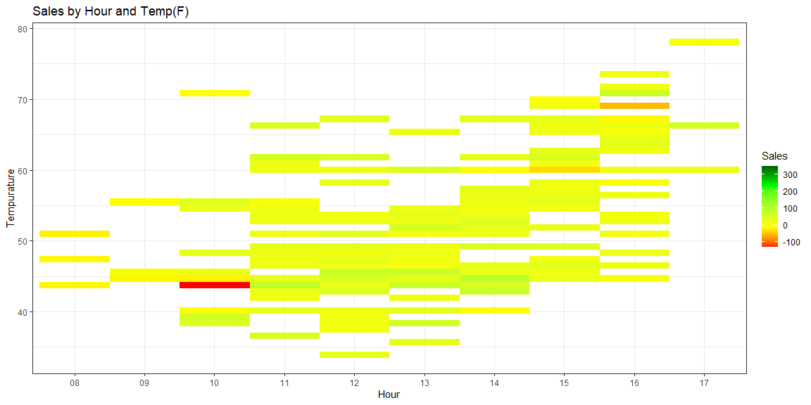

```r
# Use this R-Chunk to import all your datasets!
car_wash <- read.csv("https://byuistats.github.io/M335/data/carwash.csv")
weather_wash <- riem_measures(station = "RXE", date_start = "2016-05-13", date_end = "2016-07-18")
```

## Background

In a R markdown file, read in the car wash data https://byuistats.github.io/M335/data/carwash.csv and format it for the needs of this task.
Convert the times from UTC time to mountain time using the right function out of library(lubridate).
Create a new hourly grouping variable using ceiling_date() from library(lubridate).
Aggregate the point of sale data into hour sales totals.
Use riem_measures(station = "RXE", date_start = , date_end = ) for station RXE from library(riem) to get the matching temperatures.
Create a new hourly variable that matches your car wash hourly variable.
Merge the two datasets together.
Create a visualization that provides insight into the relationship between sales and temperature by hour of the day.

## Data Wrangling


```r
# Use this R-Chunk to clean & wrangle your data!
car_wash$time <- ymd_hms(car_wash$time, tz = "MST")
car_wash$time <- ceiling_date(car_wash$time, "hour")

weather_wash <- select(weather_wash, c(valid, tmpf))
weather_wash$time <- ymd_hms(weather_wash$valid, tz = "MST")
weather_wash$time <- ceiling_date(weather_wash$time, unit="hour")
weather_wash <- select(weather_wash, c(tmpf, time)) %>% drop_na()

fullDat <- inner_join(car_wash, weather_wash, by="time")
fullDat$hour <- format(as.POSIXct(fullDat$time), format = "%H")
```

## Data Visualization


```r
# Use this R-Chunk to plot & visualize your data!
ggplot(data=fullDat) + 
    geom_raster(aes(hour, tmpf, fill= amount)) +
    theme_bw()+
  scale_fill_gradientn(colors= c( "red","yellow", "greenyellow","green","darkgreen"))+
  labs(title= "Sales by Hour and Temp(F)", fill= "Sales")+ xlab("Hour")+ ylab("Tempurature")
```

<!-- -->

## Conclusions
